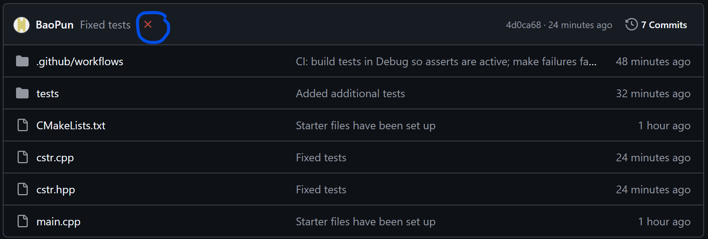

# Project 2 - Working with C Strings

# Overview
Strings are one of the most commonly used types in C++, and it has a ton of built-in functionality.
However, for this project, you will be asked to implement some of the built-in functionality using C-Strings, which are an array of characters.
While it may seem pointless to re-implement something from scratch when there already exists tools for it, doing so helps you better understand how these built-in features work for yourself.
This will also help you out immensely as a developer, as being able to come up with creative solutions is one of the most important skills to have in this field.

# Fork
Make sure to fork this repository.

# Tasks
If you look at cstr.hpp, there are 8 required functions and 2 extra credit functions.  Read the comments in cstr.cpp to see what you need to do for each function.
In main.cpp, I have written sample test cases for you.  Feel free to write additional tests if you choose.  However, where you will be graded is on GitHub itself. 
After you push your changes to GitHub, a workflow will be running, and you will see either an orange circle (tests are currently running), a red X (tests have failed), or a green checkmark (tests have passed).  When you see a green checkmark, this is how you know you are done.  If you see a red X, then click on the red X to see what tests have failed.

# Help
If you ever feel stuck or need clarification, please reach out to me via my email.  
